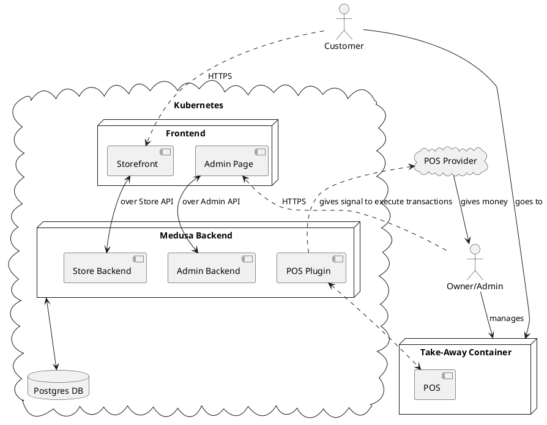

<title>{{.Title}}</title>

```plantuml
@startuml

cloud "Kubernetes"{

  node "Frontend" {
    
    [Storefront]
    [Admin Page]
  
  }

  node "Medusa Backend" {
    [Store Backend]
    [Admin Backend]
    [POS Plugin]
  }

  database "Postgres DB" {
    
  }
}

node "Take-Away Container" {
  [POS]
}

cloud "POS Provider" {

}


actor "Customer" 

actor "Owner/Admin"

"Customer" ..> [Storefront] : "HTTPS"
"Customer" --> "Take-Away Container" : "goes to"

"Owner/Admin" ..> [Admin Page] : "HTTPS"
[Admin Page] <--> [Admin Backend] : "over Admin API"
"Owner/Admin" --> "Take-Away Container": manages
[POS Plugin] ..> "POS Provider": "gives signal to execute transactions"
"POS Provider" --> "Owner/Admin": "gives money"


[POS Plugin] <..> [POS]
[Medusa Backend] <--> "Postgres DB"
[Storefront] <--> [Store Backend] : "over Store API"

@enduml
```