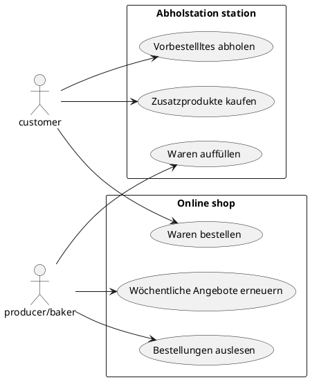

<title>{{.Title}}</title>

```plantuml
@startuml
left to right direction
actor "producer/baker" as producer
actor customer
rectangle "Abholstation station" {
  usecase "Vorbestellltes abholen" as c1
  usecase "Zusatzprodukte kaufen" as c2
  usecase "Waren auffüllen" as c3
}
rectangle "Online shop" {
   usecase "Wöchentliche Angebote erneuern" as s1
   usecase "Waren bestellen" as s2
   usecase "Bestellungen auslesen" as s3
}

producer --> s1
producer --> c3
producer --> s3
customer --> s2
customer --> c1
customer --> c2


@enduml

```
